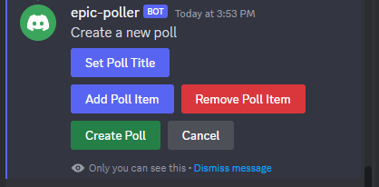

# Epic Poller
## About
This is a discord bot for setting up polls in your server.
It is created using TypeScript and used the DiscordJS package to communicate with the Discord API.

## How to use
Type `/poll` into the chat box.
The poller will reply with a message, visible only to you, to set up your poll.
In that message, you can set the poll title, add/remove items, and finally create the poll.

Once the poll is created, the poller will create a new message with the options so people can vote on it.

After five minutes, the poll will close, and the voting selection input will be removed from the message

## How to set up
I am not hosting the bot anywhere, so it needs to be hosted on your own server.
Make sure to set up a `.env` file with appropriate `DISCORD_TOKEN`, `CLIENT_ID`, and `GUILD_ID` variables.

The only discord server permissions the bots needs is `application.commands`
